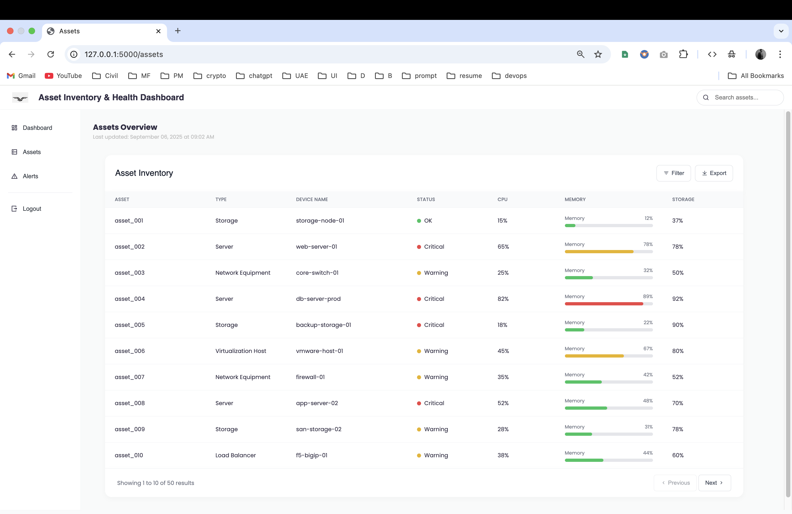

# Asset Inventory & Health Monitoring Dashboard

A comprehensive web-based monitoring dashboard built with Python-Flask for tracking server assets, performance metrics, and managing alerts in real-time.

## Table of Contents
- [Overview](#overview)
- [Features](#features)
- [Tech Stack](#tech-stack)
- [Installation](#installation)
- [Usage](#usage)
- [Project Snapshots](#project-snapshots)
- [Reports and Exports](#reports-and-exports)

## Overview

Flask-based web application that provides a **real-time view of IT assets and their health status**. The application fetches data from a JSON file, which is automatically updated across the website, powering KPI cards, charts, and asset tables.  
Admins can **monitor performance, track alerts, and export reports** in multiple formats. The dashboard ensures that IT operations remain transparent, efficient, and proactive.

## Features

- **Real-time Data Updates**  
  Data from the JSON file is automatically reflected across the dashboard (KPI cards, charts, tables).

- **Dynamic Asset & Health Tables**  
  View and filter servers, storage, and other IT assets. Apply filters on asset and alert tables based on requirements.

- **Automated Alert System**  
  Predefined checklists continuously evaluate assets. If conditions are met, alerts are triggered automatically.  
  Alerts also auto-resolve when the asset no longer meets the alert condition.

- **Export Reports**  
  Download monitoring data and reports as **CSV or PDF** for record-keeping and analysis.

- **Status Indicators**  
  Color-coded health status indicators provide a quick overview of system health.

- **User Authentication**  
  Secure login/signup system with encrypted passwords.

## Tech Stack

- **Backend**: Python, Flask, SQLAlchemy
- **Database**: SQLite (lightweight and file-based)  
- **Frontend**: HTML5, CSS3, JavaScript, Jinja2 Templates  
- **Authentication & Security**: Werkzeug password hashing  
- **Data Handling**: JSON-based asset data, auto-refresh for KPIs, charts, and tables  
- **Export Options**: CSV, PDF  
- **Icons & Visualization**: [Remix Icon](https://remixicon.com/), Chart.js

## Installation

1. **Clone the Repository**
   ```bash
   git clone https://github.com/s-varshith/AssetHealthDashboard.git
   cd AssetHealthDashboard

2. **Create a Virtual Environment (recommended)**
   ```bash
   python -m venv venv
   source venv/bin/activate   # On Windows: venv\Scripts\activate

3. **Install Dependencies**
   ```bash
   pip install -r requirements.txt

## Usage

1. **Run the Flask Application**
   ```bash
   python app.py
   
2. **Access the Dashboard**
   Open your browser and go to:
   [127.0.0.1:5000](http://127.0.0.1:5000)
   
4. **Login / Signup**

- You can **create a new user account** using the signup option  
- Or use the **default admin account**:

  - **Email:** `admin@gmail.com`  
  - **Password:** `admin123`  

5. **Dashboard Data**

- Asset details, alerts, KPIs, and reports are automatically loaded from the **JSON file**  
- Alerts are **triggered/resolved automatically** based on predefined conditions  
- Data can be **filtered** in tables (assets, alerts)  
- Reports can be **exported** in **CSV** or **PDF** format

## Project Snapshots

### Dashboard View:


### Asset View:


### Alerts View:

 
## Reports and Exports

You can export monitoring data as **CSV** or **PDF**.

### CSV Export (Preview):
  
[Download Sample CSV](readme_img_doc/Asset_inventory.csv)

### PDF Export (Preview):
  
[Download Sample PDF](readme_img_doc/Asset_inventory.pdf)
